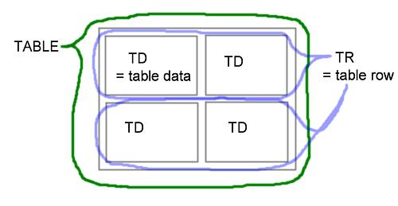

# HTML Tutorial
---

## 1. HTML Introduction

#### What is HTML?
  - HTML stands for Hyper Text Markup Language
  - HTML is the standard markup language for creating Web pages
  - HTML describes the structure of a Web page
  - HTML consists of a series of elements
  - HTML elements tell the browser how to display the content
  - HTML elements label pieces of content such as "this is a heading", "this is a button", "this is an image", "this is a link", etc.
  - Typically, HTML files must end with a `.html` file extension before they can be displayed on the browser.

#### What is an HTML Element?
An HTML element is defined by a start tag, some content, and an end tag:

```
<tagname attribute1="value" attribute2="value" > Content goes here... </tagname>
```
Or
```
<tagname attribute1="value" attribute2="value" > Content goes here... </tagname>
```
The HTML element is **everything** from the start tag to the end tag:
```html
<h1>My First Heading</h1>
<p>My first paragraph.</p>
```

| Start tag |	Element content |	End tag |
| --------- |	--------------- |	------- |
| `<h1>` |	My First Heading |	`</h1>` |
| `<p>` |	My First Heading |	`</p>` |
| `<br>` |	none |	none |


```html
<!DOCTYPE html>
<html>
<head>
<title>Page Title</title>
</head>
<body>
<!-- This is a comment -->
<h1>My First Heading</h1>
<hr/>
<p>My first paragraph.</p>

</body>
</html>
```
Example Explained:
  - The `<!DOCTYPE html>` declaration defines that this document is an HTML5 document
  - The `<html>` element is the root element of an HTML page
  - The `<head>` element contains meta information about the HTML page
  - The `<title>` element specifies a title for the HTML page (which is shown in the browser's title bar or in the page's tab)
  - The `<body>` element defines the document's body, and is a container for all the visible contents, such as headings, paragraphs, images, hyperlinks, tables, lists, etc.
  - The `<!--  -->` element defines a comment. comments are ignored by the browser.
  - The `<h1>` element defines a large heading
  - The `<hr/>` element defines a horizontal divider
  - The `<p>` element defines a paragraph
  - The `<br>` element defines a line break

Some HTML elements have no content (like the `<br>` and `<hr/>` element). These elements are called empty elements or self closing elements. They do not have an end tag!

#### Web Browsers
The purpose of a web browser (Chrome, Edge, Firefox, Safari) is to read HTML documents and display them correctly.

A browser does not display the HTML tags, but uses them to determine how to display the document:


#### HTML Page Structure
Below is a visualization of an HTML page structure:

<div class="ws-grey" style="width:99%;border:1px solid grey;padding:3px;margin:0;">&lt;html&gt;
<div style="width:90%;border:1px solid grey;padding:3px;margin:20px">&lt;head&gt;
<div style="width:90%;border:1px solid grey;padding:5px;margin:20px">&lt;title&gt;Page title&lt;/title&gt;
</div>
&lt;/head&gt;
</div>
<div class="ws-grey" style="width:90%;border:1px solid grey;padding:3px;margin:20px;">&lt;body&gt;
<div class="w3-white" style="width:90%;border:1px solid grey;padding:3px;margin:20px;">
<div style="width:90%;border:1px solid grey;padding:5px;margin:20px">&lt;h1&gt;This is a heading&lt;/h1&gt;</div>
<div style="width:90%;border:1px solid grey;padding:5px;margin:20px">&lt;p&gt;This is a paragraph.&lt;/p&gt;</div>
<div style="width:90%;border:1px solid grey;padding:5px;margin:20px">&lt;p&gt;This is another paragraph.&lt;/p&gt;</div>
</div>
&lt;/body&gt;
</div>
&lt;/html&gt;
</div>

The content inside the `<body>` section (the white area above) will be displayed in a browser. The content inside the `<title>` element will be shown in the browser's title bar or in the page's tab.

#### HTML History
Since the early days of the World Wide Web, there have been many versions of HTML:

| Year | Version |
| ---- | ------- |
| 1989	| Tim Berners-Lee invented www |
| 1991	| Tim Berners-Lee invented HTML |
| 1993	| Dave Raggett drafted HTML+ |
| 1995	| HTML Working Group defined HTML 2.0 |
| 1997	| W3C Recommendation: HTML 3.2 |
| 2008	| WHATWG HTML5 First Public Draft |
| 2012	| [WHATWG HTML5 Living Standard](http://whatwg.org/html/) |
| 2014	| [W3C Recommendation: HTML5](http://www.w3.org/TR/html5/) |
| 2016	| W3C Candidate Recommendation: HTML 5.1 |
| 2017	| [W3C Recommendation: HTML5.1 2nd Edition](http://www.w3.org/TR/html51/) |
| 2017	| [W3C Recommendation: HTML5.2](http://www.w3.org/TR/html52/) |


## 2. HTML Editors

Web pages can be created and modified by using professional HTML editors.

However, for learning HTML we recommend a simple text editor like Notepad (PC), Sublime Text, TextEdit (Mac), or VSCode. In This tutorial, we'll be using VSCode (Visual Studio Code).  

Follow the steps below to create your first web page with VSCode.

1. Download the Visual Studio Code installer from [VSCode download page]((https://code.visualstudio.com/download))

2. Once it is downloaded, run the installer (VSCodeUserSetup-{version}.exe). This will only take a minute.

3. Launch the application and Go to File > New File

4. Write some HTML
5. Save the HTML page.  Select File > Save as. Save with a `.html` or `.htm` extension. (You can use either `.htm` or `.html` as file extension. There is no difference; it is up to you.)
6. To view the HTML Page in Your Browser. Open the saved HTML file in your favorite browser (double click on the file, or right-click - and choose "Open with").

## 3. HTML Elements and their Attributes

All HTML documents must start with a document type declaration: `<!DOCTYPE html>`.

The HTML document itself begins with `<html>` and ends with `</html>`.

The visible part of the HTML document is between `<body>` and `</body>`.

##### The `<!DOCTYPE>` Declaration

The `<!DOCTYPE>` declaration represents the document type, and helps browsers to display web pages correctly.

It must only appear once, at the top of the page (before any HTML tags).

The `<!DOCTYPE>` declaration is not case sensitive.

The `<!DOCTYPE>` declaration for HTML5 is:
`<!DOCTYPE html>`


#### HTML Elements
Here we look into a list of commonly used html elements and tags before dissecting them. See the full list/reference [here](https://www.w3schools.com/tags/default.asp)

| Tag	| Description |
| ---	| ----------- |
| `<!--whatever--> `	| Defines the document type |
| `<!DOCTYPE>` 	| Defines the document type |
| `<a>`	| Defines a hyperlink |
| `<a>` |	Defines a hyperlink |

#### The `<head>` Element and it's children

The `<head>` element is a container for metadata (data about data) and is placed between the `<html>` tag and the `<body>` tag.

Metadata is data about the HTML document. Metadata is not displayed.

Metadata typically define the document title, character set, styles, scripts, and other meta information.

Some tags are meant to be used only between the `<head>` ... `</head>` tag. Some are:

| Tag	| Description |
| ---	| ----------- |
| `<title>` | Defines a title for the document on browser tab |
| `<style>` | Defines style information for a document |
| `<meta>` | Defines "metadata" about an HTML document |
| `<link>` | Defines the relationship between a document and an external resource (mostly used to link to style sheets) |
| `<script>` | Defines a client-side script |
| `<noscript>` | Defines an alternate content for users that do not support client-side scripts |
| `<base>` | Specifies the base URL/target for all relative URLs in a document |

##### A closer look at the tags

##### `<title>`:

The `<title>` element:
- defines a title in the browser toolbar
- provides a title for the page when it is added to favorites/bookmarks.
- displays a title for the page in search-engine results
You can NOT have more than one `<title>` element in an HTML document.

```html
<title> HTML Tutorial By Ilodigwe Chinaza</title>
```

##### `<style>`:
The `<style>` tag is one of the ways of adding style information (CSS) to a document.

Inside the `<style>` element you specify how HTML elements should render in a browser.

```html
<style>
  h1{background-color:"red"}
</style>
```

##### `<meta>`:
The `<meta>` tag defines metadata about an HTML document. Metadata is data (information) about data.

`<meta>` tags always go inside the `<head>` element, and are typically used to specify character set, page description, keywords, author of the document, and viewport settings.

Metadata will not be displayed on the page, but is machine parsable.

Metadata is used by browsers (how to display content or reload page), search engines (keywords), and other web services.

There is a method to let web designers take control over the viewport (the user's visible area of a web page), through the `<meta>` tag (See "Setting The Viewport" example below).

| Attribute	| Value	| Description |
| --------	| -----	| ----------- |
| charset	| character_set	| Specifies the character encoding for the HTML document |
| content	| text	| Specifies the value associated with the http-equiv or name attribute |
| http-equiv	| content-security-policy, content-type, default-style, refresh	| Provides an HTTP header for the information/value of the content attribute |
| name	| application-name, author, description, generator, keywords, viewport	| Specifies a name for the metadata |

Examples
```html
<!-- Define keywords for search engines: -->
<meta name="keywords" content="HTML, CSS, JavaScript">

<!-- Define a description of your web page: -->
<meta name="description" content="Free Web tutorials for HTML and CSS">

<!-- Define the author of a page: -->
<meta name="author" content="John Doe">

<!-- Refresh document every 30 seconds: -->
<meta http-equiv="refresh" content="30">

<!-- Setting the viewport to make your website look good on all devices: -->
<meta name="viewport" content="width=device-width, initial-scale=1.0">
```
`meta` is an empty element, it contains attributes only.

##### `<link>`:
  - defines the relationship between the current document and an external resource.
  - is most often used to link to external style sheets or to add a favicon to your website.

  - is an empty element, it contains attributes only.

| Attribute	| Value	| Description |
| --------	| -----	| ----------- |
| crossorigin	| anonymous, use-credentials	| Specifies how the element handles cross-origin requests |
| href	| `URL`	| Specifies the location of the linked document either as an **absolute URL** - points to another web site (like href="http://www.example.com/theme.css") or a **relative URL** - points to a file within a web site (like href="/themes/theme.css") |
| hreflang	| [language_code](https://www.w3schools.com/tags/ref_language_codes.asp) (e.g "en" for english)	| Specifies the language of the text in the linked document |
| media	| print, screen, speech, all(default) | Specifies on what device the linked document will be displayed. [more](https://www.w3schools.com/tags/att_link_media.asp) |
| referrerpolicy	| no-referrer, no-referrer-when-downgrade, origin, origin-when-cross-origin, unsafe-url	| Specifies the reference information that will be sent to the server when the user clicks on a hyperlink or resource, [more](https://www.w3schools.com/tags/att_iframe_referrerpolicy.asp) |
| rel	| alternate, author, dns-prefetch, help, icon, license, next, pingback, preconnect, prefetch, preload, prerender, prev, search, stylesheet	Required. | Specifies the relationship between the current document and the linked document. [more](https://www.w3schools.com/tags/att_link_rel.asp) |
| sizes	| HeightxWidth, any	| Specifies the size of the linked resource. Only for rel="icon". [more](https://www.w3schools.com/tags/att_link_sizes.asp) |
| type	| [media_type](http://www.iana.org/assignments/media-types/) e,g "text/css"	| Specifies the media type of the linked document |

```html

<!-- "hreflang" attribute tells the browser to interpret resource in english: -->
<link rel="stylesheet" href="styles.css" hreflang="en">

<!-- "rel" attribute specifies resource as an icon (favicon): -->
<link rel="icon" type="image/x-icon" href="favicon.ico">

<!-- the "type" attribute indicates that the linked document is an a text file of css format -->
<link rel="stylesheet" type="text/css" href="styles.css">

<!-- "size" attribute to specify size of icon resource: -->
<link rel="icon" href="demo_icon.gif" type="image/gif" sizes="16x16">

<!-- "media" attribute - Two different style sheets for two different media types (screen and print): -->
<link rel="stylesheet" type="text/css" href="theme.css">
<link rel="stylesheet" type="text/css" href="print.css" media="print">


```

##### `<script>`:

- used to embed a client-side script (JavaScript).

- contains scripting statements, or it points to an external script file through the src attribute.

- common uses for JavaScript are image manipulation, form validation, and dynamic changes of content.

```html
<!-- inline script -->
<script>
  document.getElementById("demo").innerHTML = "Hello JavaScript!";
</script>

<!-- async attribute -->
<script src="demo_async.js" async></script>

<!-- defer attribute -->
<script src="demo_defer.js" defer></script>


<!-- integrity attribute -->
<script src="https://code.jquery.com/jquery-3.3.1.slim.min.js"
integrity="sha384-q8i/X+965DzO0rT7abK41JStQIAqVgRVzpbzo5smXKp4YfRvH+8abtTE1Pi6jizo"
crossorigin="anonymous"></script>

<!-- type attribute -->
<script type="application/javascript">
document.getElementById("demo").innerHTML = "Hello JavaScript!";
</script>

<!--  -->

```
| Attribute	| Value	| Description |
| --------	| -----	| ----------- |
| async	| boolean attribute	| postpone execution till full script is downloaded (only for external scripts and if the `src` attribute is present) |
| crossorigin	| anonymous, use-credentials	| Sets the mode of the request to an HTTP CORS Request |
| defer	| defer	| postpone execution till the whole page is parsed/interpreted (only for external scripts) |
| integrity	| filehash to check	| Allows a browser to check the fetched script to ensure that the code is never loaded if the source has been manipulated. The webpage holds the hash and the server holds the file (the .js file in this case). The browser downloads the file, then checks it, to make sure that it is a match with the hash in the integrity attribute. If it matches, the file is used, and if not, the file is blocked |
| nomodule	| True, False	| Specifies that the script should not be executed in browsers supporting ES2015 modules |
| referrerpolicy	| (...check `<link>` attributes)	| ----------- |
| src	| `URL`	| Specifies the URL of an external script file (just like "href" ) |
| type	| [scripttype](http://www.iana.org/assignments/media-types/) e.g ( "text/javascript" )	| Specifies the media type of the script |

#####  `<noscript>`
Display stuff for users that have disabled scripts in their browser, or have a browser that doesn't support client-side scripting.

##### `<base>`:
- Specifies the base URL and/or target for all relative URLs in a document.

- Must have either an href or a target attribute present, or both.

- There can only be one single <base> element in a document, and it must be inside the <head> element.

```html
<head>
  <base href="https://www.w3schools.com/" target="_blank">
</head>

<body>

<a href="tags/tag_base.asp">HTML base Tag</a>
</body>
```
`target` atttribute specifies the default target for all hyperlinks and forms in the page. This attribute can be overridden by using the target attribute for each hyperlink/form.
  - `_blank` -	Opens the link in a new window or tab
  - `_self` -	Default. Opens the link in the same frame as it was clicked
  - `_parent` -	Opens the link in the parent frame
  - `_top` -	Opens the link in the full body of the window


#### HTML Element Attributes
Before moving on lets talk a little more about attributes.

In HTML, elements can have attributes that further modifies their behaviour. 
```
<tagname attribute1="value" attribute2="value" > Content goes here... </tagname>
```
Some attribute only applies to some elements but global attributes can be applied to any element.

**List of Global attributes**:

| Attribute	| Description |
| --------	| ----------- |
| accesskey	| Specifies a shortcut key to activate/focus an element |
| class	| Specifies one or more classnames for an element (refers to a class in a style sheet). Must begin with a letter. No whitespace|
| contenteditable	| Specifies whether the content of an element is editable or not. When the contenteditable attribute is not set on an element, the element will inherit it from its parent. |
| data-*	| Used to store custom data private to the page or application |
| dir	| Specifies the text direction for the content in an element e.g "ltr" (left-to-right) or "rtl" (right-to-left) |
| draggable	| Specifies whether an element is draggable or not |
| hidden	| Specifies that an element is not yet, or is no longer, relevant |
| lang	| Specifies the language of the element's content |
| spellcheck	| Specifies whether the element is to have its spelling and grammar checked or not |
| style	| Specifies an inline CSS style for an element |
| tabindex	| Specifies the tabbing order of an element |
| title	| Specifies extra information about an element |
| translate	| Specifies whether the content of an element should be translated or not |

**Example**:
```html
<!-- To avoid conflict with other key standards, most browsers will use accesskeys only if pressed together with the "Alt" key. -->
<a href="https://www.w3schools.com/html/" accesskey="h">HTML</a><br>
<a href="https://www.w3schools.com/css/" accesskey="c">CSS</a>

<!-- "class" attribute -->
<h1 class="intro">Header 1</h1>
<!-- "id" attribute -->
<h1 id="myHeader">Hello World!</h1>

<!-- "contenteditable" attribute: An editable paragraph -->
<p contenteditable="true">This is an editable paragraph.</p>

<!-- data-* attribute: An editable paragraph -->
<ul>
  <li data-animal-type="bird">Owl</li>
  <li data-animal-type="fish">Salmon</li>
  <li data-animal-type="spider">Tarantula</li>
</ul>
<!-- "dir"  attribute: A paragraph with a right-to-left direction: -->
<p dir="rtl">Write this text right-to-left!</p>

<!-- "draggable" attribute  -->
<p draggable="true">This is a draggable paragraph.</p>

<!-- "hidden" attribute: Some French text in a paragraph -->
<p hidden>This paragraph should be hidden.</p>

<!-- "fr" attribute -->
<p lang="fr">Ceci est un paragraphe.</p>

<!-- "spellcheck" attribute -->
<textarea spellcheck="true">This is a paragraph.</textarea>

<!-- "style" attribute -->
<h1 style="color:blue;text-align:center;">This is a header</h1>

<!-- "title" attribute -->
<p><abbr title="World Health Organization">WHO</abbr> was founded in 1948.</p>
<p title="Free Web tutorials">W3Schools.com</p>

<!-- "translate" attribute -->
<p translate="no">Don't translate this!</p>
<p>This can be translated to any language.</p>

```

#### The `<body>` Element and it's children

  - The <body> tag defines the document's body.

  - The `<body>` element contains all the contents of an HTML document, such as headings(`<h1>` to `<h6>`), paragraphs(`<p>`), images(``), hyperlinks(`<a>`), tables(`<table>`), lists(`<li>`), etc.

  - Note: There can only be one `<body>` element in an HTML document.

| Tag	| Description |
| ---	| ----------- |
| **Headings**  |
| `<h1>` to `<h6>` | Defines HTML headings |
| **Paragraph**  |
| `<p>`	| Defines a paragraph |
| **Formatting:** |
| `<b>`	| Defines bold text |
| `<del>` | Defines text that has been deleted from a document (strikethrough) |
| `<em>` | Defines emphasized text |
| `<i>` | Defines a part of text in an alternate voice or mood |
| `<ins>` | Defines a text that has been inserted into a document |
| `<mark>` | Defines marked/highlighted text |
| `<pre>` | Defines preformatted text (preserve line breaks) |
| `<small>` | Defines smaller font-size for text |
| `<sub>` | Defines subscripted text |
| `<sup>` | Defines subscripted text |
| `<strong>` | Defines important text |
| **Quotations:** |
| `<blockquote>` | Defines a section that is quoted from another source |
| `<q>`  | Defines a short quotation |
| **Tables:** |
| `<table>` | Defines a table |
| `<thead>` | Groups the header content in a table |
| `<tr>` | Defines a row in a table |
| `<th>` | Defines a header cell in a table |
| `<tbody>` | Groups the body content in a table |
| `<td>` | Defines a cell in a table |
| `<tfoot>` | Groups the footer content in a table |
| `<colgroup>` | Specifies a group of one or more columns in a table for formatting |
| `<col>`  | Specifies column properties for each column within a `<colgroup>` element  |
| **Lists** |
| `<ol>` | Defines an ordered list |
| `<ul>` | Defines an unordered list |
| `<li>`  | Defines a list item |
| **Computer Code:** |
| `<code>` | Defines a piece of computer code |
| `<kbd>` | Defines keyboard input |
| `<samp>` | Defines sample output from a computer program |
| `<var>` | Defines a variable |
| **Form:** |
| `<form>`| Defines an HTML form for user input |
| `<input>`| Defines an input element |
| `<label>`| Defines a label for an `<input>` element |
| `<legend>`| Defines a caption for a `<fieldset>` element |
| `<optgroup>`| Defines a group of related options in a drop-down list |
| `<option>`| Defines an option in a drop-down list |
| `<select>`| Defines a drop-down list |
| `<fieldset>`| Groups related elements in a form |
| `<textarea>`| Defines a multiline input control (text area) |
| **Media:** | |
| `<audio>` | Defines an embedded sound content |
| `<video>` | Defines an embedded video content |
| `<svg>` | Defines a container for SVG graphics |
| `<figure>` | Specifies a self-contained content |
| `<figcaption>` | Defines a caption for a `<figure>` element | 
| **Others:**
| `<a>` | Defines a hyperlink |
| `<br>` | Defines a single line break |
| `<button>` | Defines a clickable button |
| `<div>` | Defines a section in a document |
| `<hr>` | Defines a thematic change in the content |
| `<map>` | Defines an image map |
| `<nav>` | Defines navigation links |
| `<span>` | Defines a section in a document |
| `<summary>` | Defines a visible heading for a `<details>` element |
| `<details>` | Defines additional details that the user can view or hide |
| `<u>` | Defines some text that is unarticulated and styled differently from normal text |
| `<footer>` | Defines a footer for a document or section |


#### A Closer Look:

#### Headings Tags

`<h1> - <h6>`
  - The `<h1>` to `<h6>` tags are used to define HTML headings.

  - `<h1>` defines the most important heading. `<h6>` defines the least important heading.

  - Note: Only use one `<h1>` per page - this should represent the main heading/subject for the whole page. 
  - Also, do not skip heading levels - start with `<h1>`, then use `<h2>`, and so on.

```html
<h1>This is heading 1</h1>
<h2>This is heading 2</h2>
<h3>This is heading 3</h3>
<h4>This is heading 4</h4>
<h5>This is heading 5</h5>
<h6>This is heading 6</h6>
```


**Paragraphs:**

`<p>`:

The `<p>` tag defines a paragraph.

Browsers automatically add a single blank line before and after each `<p>` element.

```html
<p>This is a normal paragraph</p><p>This is also a normal paragraph</p>
```
**Formatting:**

`<b>`: 

The `<b>` tag specifies bold text without any extra importance.

According to the HTML5 specification, the `<b>` tag should be used as a LAST resort when no other tag is more appropriate. The specification states that headings should be denoted with the `<h1>` to `<h6>` tags, emphasized text should be denoted with the `<em>` tag, important text should be denoted with the `<strong>` tag, and marked/highlighted text should be denoted with the `<mark>` tag.

Tip: You can also use the following CSS to set bold text: `font-weight: bold`;.

```html
<p>This is normal text - <b>and this is bold text</b>.</p>
```
`<del>`:

The `<del>` tag defines text that has been deleted from a document. Browsers will usually strike a line through deleted text.

```html
<p>My favorite color is <del>blue</del> <ins>red</ins>!</p>
```
`<em>`

The `<em>` tag is used to define emphasized text. The content inside is typically displayed in italic.

A screen reader will pronounce the words in `<em>` with an emphasis, using verbal stress

```html
<p>You <em>have</em> to hurry up!</p>

<p>We <em>cannot</em> live like this.</p>
```
`<i>`

The `<i>` tag defines a part of text in an alternate voice or mood. The content inside is typically displayed in italic.

The `<i>` tag is often used to indicate a technical term, a phrase from another language, a thought, a ship name, etc.

Use the `<i>` element only when there is not a more appropriate semantic element, such as:

```html

```
`<ins>`

The <ins> tag defines a text that has been inserted into a document. Browsers will usually underline inserted text

```html
<p>My favorite color is <del>blue</del> <ins>red</ins>!</p>
```
`<mark>`

The `<mark>` tag defines text that should be marked or highlighted.

```html

```
`<pre>`
```html

```
`<small>`
```html

```
`<sub>`

The `<sub>` tag defines subscript text. Subscript text appears half a character below the normal line, and is sometimes rendered in a smaller font. Subscript text can be used for chemical formulas, like H<sub>2</sub>O.

```html
<p>This text contains <sub>subscript</sub> text.</p>
```
`<sup>`

The `<sup>` tag defines superscript text. Superscript text appears half a character above the normal line, and is sometimes rendered in a smaller font. Superscript text can be used for footnotes, like 23<sup>2</sup> .

```html
<p>This text contains <sup>superscript</sup> text.</p>
```
`<strong>`
```html

```

**Quotations:**
`<blockquote>`
The `<blockquote>` tag specifies a section that is quoted from another source.

Browsers usually indent `<blockquote>` elements (look at example below to see how to remove the indentation).

```html
<blockquote cite="http://www.worldwildlife.org/who/index.html">
For 50 years, WWF has been protecting the future of nature. The world's leading conservation organization, WWF works in 100 countries and is supported by 1.2 million members in the United States and close to 5 million globally.
</blockquote>
```
`<q>`

The `<q>` tag defines a short quotation.

Browsers normally insert quotation marks around the quotation

```html
<p>WWF's goal is to:
<q>Build a future where people live in harmony with nature.</q>
We hope they succeed.</p>
```

**Tables:**

`<table>`

The <table> tag defines an HTML table.

An HTML table consists of one `<table>` element and one or more `<tr>`, `<th>`, and `<td>` elements.

The `<tr>` element defines a table row, the `<th>` element defines a table header, and the `<td>`element defines a table cell.

An HTML table may also include `<caption>`, `<colgroup>`, `<thead>`, `<tfoot>`, and `<tbody>` elements.



```html
<table>
  <tr>
    <th>Month</th>
    <th>Savings</th>
  </tr>
  <tr>
    <td>January</td>
    <td>$100</td>
  </tr>
</table>
```

`<tr>`
The `<tr>` tag defines a row in an HTML table.

A `<tr>` element contains one or more `<th>` or `<td>` elements.
`<th>`

The `<th>` tag defines a header cell in an HTML table.

An HTML table has two kinds of cells:

  - Header cells - contains header information (created with the `<th>` element)
  - Data cells - contains data (created with the `<td>` element)
The text in `<th>` elements are bold and centered by default.

The text in `<td>` elements are regular and left-aligned by default.

| Attribute |	Value |	Description |
| --------- |	----- |	--------- |
| colspan	| number	| Specifies the number of columns a cell should span |
|headers	| header_id	| Specifies one or more header cells a cell is related to |
| rowspan	| number	| Sets the number of rows a cell should span |
| scope	| col, colgroup, row, rowgroup	| Specifies whether a header cell is a header for a column, row, or group of columns or rows |

```html
<!-- colspan attribute -->
<table>
  <tr>
    <th colspan="2">Monthly Savings</th>
  </tr>
  <tr>
    <td>January</td>
    <td>$100</td>
  </tr>
  <tr>
    <td>February</td>
    <td>$80</td>
  </tr>
</table>
 
<!-- headers attribute -->
<table>
  <tr>
    <th id="name" colspan="2">Name</th>
  </tr>
  <tr>
    <th headers="name">Firsname</th>
    <th headers="name">Lastname</th>
  </tr>
</table>

<!-- rowspan attribute -->
<table>
  <tr>
    <th>Month</th>
    <th>Savings</th>
    <th rowspan="3">Savings for holiday!</th>
  </tr>
  <tr>
    <td>January</td>
    <td>$100</td>
  </tr>
  <tr>
    <td>February</td>
    <td>$80</td>
  </tr>
</table>

```

`<td>`

The `<td>` tag defines a standard data cell in an HTML table.

An HTML table has two kinds of cells:

Header cells - contains header information (created with the `<th>` element)
Data cells - contains data (created with the `<td>` element)
The text in `<td>` elements are regular and left-aligned by default.

The text in `<th>` elements are bold and centered by default. 

| Attribute |	Value |	Description |
| --------- |	----- |	--------- |
| colspan	| number	| Specifies the number of columns a cell should span |
|headers	| header_id	| Specifies one or more header cells a cell is related to |
| rowspan	| number	| Sets the number of rows a cell should span |

```html

```

`<thead>`, `<tbody>`, `<tfoot>`

The `<thead>` tag is used to group header content in an HTML table.

The `<thead>` element is used in conjunction with the `<tbody>` and `<tfoot>` elements to specify each part of a table (header, body, footer).

Browsers can use these elements to enable scrolling of the table body independently of the header and footer. Also, when printing a large table that spans multiple pages, these elements can enable the table header and footer to be printed at the top and bottom of each page.

The `<thead>`, `<tbody>`, and `<tfoot>` elements will not affect the layout of the table by default. However, you can use CSS to style these elements (see example below)!

```html
<table>
  <thead>
    <tr>
      <th>Month</th>
      <th>Savings</th>
    </tr>
  </thead>
  <tbody>
    <tr>
      <td>January</td>
      <td>$100</td>
    </tr>
    <tr>
      <td>February</td>
      <td>$80</td>
    </tr>
  </tbody>
  <tfoot>
    <tr>
      <td>Sum</td>
      <td>$180</td>
    </tr>
  </tfoot>
</table>
```

`<colgroup>`

The `<colgroup>` tag specifies a group of one or more columns in a table for formatting.

The `<colgroup>` tag is useful for applying styles to entire columns, instead of repeating the styles for each cell, for each row.

Note: The `<colgroup>` tag must be a child of a `<table>` element, after any `<caption>` elements and before any `<thead>`,` <tbody>`, `<tfoot>`, and `<tr>` elements.

Tip: To define different properties to a column within a `<colgroup>`, use the `<col>` tag within the `<colgroup>` tag.


`<col>`

The `<col>` tag specifies column properties for each column within a `<colgroup>` element.

The `<col>` tag is useful for applying styles to entire columns, instead of repeating the styles for each cell, for each row.


```html
<table>
  <colgroup>
    <col span="2" style="background-color:red">
    <col style="background-color:yellow">
  </colgroup>
  <tr>
    <th>ISBN</th>
    <th>Title</th>
    <th>Price</th>
  </tr>
  <tr>
    <td>3476896</td>
    <td>My first HTML</td>
    <td>$53</td>
  </tr>
</table>
```


**List:**

`<ol>`

The `<ol>` tag defines an ordered list. An ordered list can be numerical or alphabetical.

The `<li>` tag is used to define each list item.

| Attribute	| Value	| Description |
| --------	| -----	| ----------- |
| reversed	| reversed	| Specifies that the list order should be reversed (9,8,7...) |
| start	| number	| Specifies the start value of an ordered list |
| type	| 1,A,a,I,i	| Specifies the kind of marker to use in the list |

```html
<ol>
  <li>Coffee</li>
  <li>Tea</li>
  <li>Milk</li>
</ol>

<ol start="50" type="A">
  <li>Coffee</li>
  <li>Tea</li>
  <li>Milk</li>
</ol>

```


`<li>`

The `<li>` tag defines a list item.

The `<li`> tag is used inside ordered lists(`<ol>`) and unordered lists (`<ul>`).

In `<ul>` and , the list items will usually be displayed with bullet points.

In `<ol>`, the list items will usually be displayed with numbers or letters.

| Attribute	| Value	| Description |
| --------	| -----	| ----------- |
| value	| number	| Only for `<ol>` lists. Specifies the start value of a list item. The following list items will increment from that number |

```html
<ol>
  <li value="100">Coffee</li>
  <li>Tea</li>
  <li>Milk</li>
  <li>Water</li>
  <li>Juice</li>
  <li>Beer</li>
</ol>
```

`<ul>`

The `<ul>` tag defines an unordered (bulleted) list.

Use the `<ul>` tag together with the `<li>` tag to create unordered lists.

```html
<ul style="list-style-type:circle">
  <li>Coffee</li>
  <li>Tea</li>
  <li>Milk</li>
</ul>

<ul style="list-style-type:disc">
  <li>Coffee</li>
  <li>Tea</li>
  <li>Milk</li>
</ul>

<ul style="list-style-type:square">
  <li>Coffee</li>
  <li>Tea</li>
  <li>Milk</li>
</ul>
```

**Computer Code:**

`<code>`

The `<code>` tag is used to define a piece of computer code. The content inside is displayed in the browser's default monospace font.

```html
<p>The HTML <code><button></code> tag defines a clickable button.</p>
```
`<kbd>`

The `<kbd>` tag is used to define keyboard input. The content inside is displayed in the browser's default monospace font.

```html
<p>Press <kbd>Ctrl</kbd> + <kbd>C</kbd> to copy text (Windows).</p>
```
`<samp>`

The `<samp>` tag is used to define sample output from a computer program. The content inside is displayed in the browser's default monospace font.
```html
<p>Message from my computer:</p>

<p><samp>File not found.<br>Press F1 to continue</samp></p>

```
`<var>`

The `<var>` tag is used to defines a variable in programming or in a mathematical expression. The content inside is typically displayed in *italic*.

```html
<p>The area of a triangle is: 1/2 x <var>b</var> x <var>h</var>, where <var>b</var> is the base, and <var>h</var> is the vertical height.</p>
```
**Form:**

`<form>`

The `<form>` tag is used to create an HTML form for user input.

The `<form>` element can contain one or more of the following form elements:

  - `<input>`
  - `<textarea>`
  - `<button>`
  - `<select>`
  - `<option>`
  - `<optgroup>`
  - `<fieldset>`
  - `<label>`
  - `<output>`

```html
<form action="/action_page.php" method="get">
  <label for="fname">First name:</label>
  <input type="text" id="fname" name="fname"><br><br>
  <label for="lname">Last name:</label>
  <input type="text" id="lname" name="lname"><br><br>
  <input type="submit" value="Submit">
</form>
```

| Attribute	| Value	| Description |
| ---------	| -----	| ----------- |
| action	| URL	| Specifies where to send the form-data when a form is submitted |
| autocomplete	| on,off	| Specifies whether a form should have autocomplete on or off |
| enctype	| application/,x-www-form-urlencoded, multipart/form-data, text/plain	| Specifies how the form-data should be encoded when submitting it to the server (only for method="post") |
| autocomplete	| on, off	| Specifies whether a form should have autocomplete on or off |
| method	| get, post	| Specifies the HTTP method to use when sending form-data |
| novalidate	| novalidate	| Specifies that the form should not be validated when submitted |
| name	| text	| Specifies the name of a form |
| target	| _blank, _self, _parent, _top	| Specifies where to display the response that is received after submitting the form |


`<input>`

The `<input>` tag specifies an input field where the user can enter data.

The `<input>` element is the most important form element.

The `<input>` element can be displayed in several ways, depending on the type attribute.

The different input types are as follows:

- `<input type="button">`
- `<input type="checkbox">`
- `<input type="color">`
- `<input type="date">`
- `<input type="datetime-local">`

- `<input type="email">`
- `<input type="file">`
- `<input type="hidden">`
- `<input type="image">`
- `<input type="month">`
- `<input type="number">`
- `<input type="password">`
- `<input type="radio">`
- `<input type="range">`
- `<input type="reset">`
- `<input type="search">`
- `<input type="submit">`
- `<input type="tel">`
- `<input type="text">` (default value)
- `<input type="time">`
- `<input type="url">`
- `<input type="week">`

| Attribute	| Value	| Description |
| --------	| -----	| ----------- |
| accept	| file_extension or ( audio/#, video/#, image/# ) media_type	| Specifies a filter for what file types the user can pick from the file input dialog box (only for type="file") |
| alt	| text	| Specifies an alternate text for images (only for type="image") |
| autocomplete	| on, off	| Specifies whether an `<input>` element should have autocomplete enabled |
| autofocus	| autofocus	| Specifies that an `<input>` element should automatically get focus when the page loads |
| checked	| checked	| Specifies that an `<input>` element should be pre-selected when the page loads (for type="checkbox" or type="radio") |
| disabled	| disabled	| Specifies that an `<input>` element should be disabled |
| form	| form_id	| Specifies the form the `<input>` element belongs to |
| formaction	| URL	| Specifies the URL of the file that will process the input control when the form is submitted (for type="submit" and type="image") |
| height	| pixels (e.g 50px)	| Specifies the height of an `<input>` element (only for type="image") |
| max	| number, date	| Specifies the maximum value for an `type="number" or type="date"` element |
| min	| number, date	| Specifies the minimum value for an `type="number" or type="date"` element |
| maxlength	| number	| Specifies the maximum number of characters allowed in an `<input>` element |
| minlength	| number	| Specifies the minimum number of characters allowed in an `<input>` element |
| multiple	| multiple	| Specifies that a user can enter more than one value in an `<input>` element |
| name	| text	| needed to reference the form data after the form is submitted (if you omit the name attribute, no data from that input will be submitted). This is used in the "key":"value" on submission |
| pattern	| regexp	| Specifies a regular expression that an `<input>` element's value is checked against |
| placeholder	| text	| Specifies a short hint that describes the expected value of an `<input>` element |
| readonly	| readonly	| Specifies that an input field is read-only i.e cannot be changed by the user |
| required	| required	| Specifies that an input field must be filled out before submitting the form |
| size	| number	| Specifies the width, in characters, of an `<input>` element |
| src	| URL	| Specifies the URL of the image to use as a submit button (only for type="image") |
| step	| number, any	| Specifies the interval between legal numbers in an input field |
| type	| button, checkbox, color, date, datetime-local, email, file, hidden, image, month, number, password, radio, range, reset, search, submit, tel, text, time, url, week |	Specifies the type `<input>` element to display |
| value	| text	| Specifies the value of an `<input>` element |
| width	| pixels (e.g 50px)	| Specifies the width of an `<input>` element (only for type="image") |

```html

<form action="/action_page.php" id="form1">
  <label for="img">Select image:</label>
  <!-- accept, multiple attribute -->
  <input type="file" id="img" name="img" accept="image/*" multiple><br><br>

  <!-- alt, width, height and src attribute -->
<label for="image">Image 1:</label>
<input type="image" src="submit.gif" alt="Submit" width="48" height="48"><br><br>

  <!-- name, autocomplete, autofocus attribute -->
<label for="email">Email:</label>
<input type="email" id="email" name="email" autocomplete="off" autofocus><br><br>

  <!-- checked, disabled attribute -->
<label for="vehicle2"> Name of vehicle</label><br>
<input type="checkbox" name="vehicle3" value="Car" checked>
<input type="checkbox" name="vehicle3" value="Boat" disabled>

  <!-- min, max attribute -->

<label for="quantity">Quantity (between 2 and 15):</label>
  <input type="number" id="quantity" name="quantity" min="2" max="15" step="3"><br><br>

  <!-- placeholder, maxlength, minlength attribute -->
<label for="username">Username:</label>
  <input type="text" id="username" name="username" minlength="10" maxlength="20" placeholder="Enter Username"><br><br>

  <!-- readonly attribute -->
  <label for="country">Country:</label>
  <input type="text" id="country" name="country" value="Nigeria" readonly><br><br>

  <input type="submit">
</form>


  <!-- form attribute -->
<label for="lname">Last name:</label>
<input type="text" id="lname" name="lname" form="form1">
```


`<label>`

The <label> tag defines a label for several elements.
Proper use of labels with the elements above will benefit:

  - Screen reader users (will read out loud the label, when the user is focused on the element)
  - Users who have difficulty clicking on very small regions (such as checkboxes) - because when a user clicks the text within the <label> element, it toggles the input (this increases the hit area). 


`<select>` and `<option>` tags

The `<select>` element is used to create a drop-down list.

The `<select>` element is most often used in a form, to collect user input.

The `<option>` tags inside the `<select>` element define the available options in the drop-down list. 

`<option>` Attributes: 

| Attribute	| Value	| Description |
| --------	| ----	| ----------- |
| disabled	| disabled	| Specifies that an option should be disabled |
| label	| text	| Specifies a shorter label for an option |
| selected	| selected	| Specifies that an option should be pre-selected when the page loads |
| value	| text	| Specifies the value to be sent to a server |

```html
<label for="cars">Choose a car:</label>
<select name="cars" id="cars">
  <option value="volvo">Volvo</option>
  <option value="saab" selected>Saab</option>
  <option value="mercedes">Mercedes</option>
  <option value="audi">Audi</option>
</select>
```


`<optgroup>`
The `<optgroup>` tag is used to group related options in a `<select>` element (drop-down list).

```html
<label for="cars">Choose a car:</label>
<select  name="cars" id="cars">
  <optgroup label="Swedish Cars">
    <option value="volvo">Volvo</option>
    <option value="saab">Saab</option>
  </optgroup>
  <optgroup label="German Cars">
    <option value="mercedes">Mercedes</option>
    <option value="audi">Audi</option>
  </optgroup>
</select>
```

`<fieldset>` and `<legend>`

The `<fieldset>` tag is used to group related elements in a form.

The `<legend>` tag defines a caption for the `<fieldset>` element.

```html
<form action="/action_page.php">
  <fieldset>
            <legend>Personal Info:</legend>
            <label for="fname">First name:</label>
            <input type="text" id="fname" name="fname"><br><br>
            <label for="lname">Last name:</label>
            <input type="text" id="lname" name="lname"><br><br>
        </fieldset>
        <fieldset>
            <legend>Contact Info:</legend>
            <label for="email">Email:</label>
            <input type="email" id="email" name="email"><br><br>
            <label for="address">Address:</label>
            <input type="text" id="address" name="address"><br><br>
            <input type="submit" value="Submit">
        </fieldset>
</form>
```

`<textarea>`

The `<textarea>` tag defines a multi-line text input control.

The `<textarea>` element is often used in a form, to collect user inputs like comments or reviews.

A text area can hold an unlimited number of characters, and the text renders in a fixed-width font (usually Courier).

The size of a text area is specified by the cols and rows attributes (or with CSS).

```html
<label for="w3review">Review of W3Schools:</label>

<textarea id="w3review" name="w3review" rows="4" cols="50">
At w3schools.com you will learn how to make a website. They offer free tutorials in all web development technologies.
</textarea>
```

**Media:**

``

The `` tag is used to embed an image in an HTML page.

The `` tag has two required attributes:

  - `src` - Specifies the path to the image
  - `alt` - Specifies an alternate text for the image, if the image for some reason cannot be displayed.

it also asccepts `width` and `height` attributes

```html

```

`<audio>`

The `<audio>` tag is used to embed sound content in a document, such as music or other audio streams.

The `<audio>` tag contains one or more `<source>` tags with different audio sources. The browser will choose the first source it supports.

The text between the `<audio>` and `</audio>` tags will only be displayed in browsers that do not support the `<audio>` element.

There are three supported audio formats in HTML: MP3, WAV, and OGG.

`<audio>`
```html
<audio controls>
  <source src="horse.ogg" type="audio/ogg">
  <source src="horse.mp3" type="audio/mpeg">
  Your browser does not support the audio tag.
</audio>

```

| Attribute	| Value	| Description |
| -------	| -------	| ------- |
| autoplay	| autoplay	| Specifies that the audio will start playing as soon as it is ready |
| controls	| controls	| Specifies that audio controls should be displayed (such as a play/pause button etc) |
| loop	| loop	| Specifies that the audio will start over again, every time it is finished |
| muted	| muted	| Specifies that the audio output should be muted |
| preload	| auto, metadata, none	| Specifies if and how the author thinks the audio should be loaded when the page loads |
| src	| URL	| Specifies the URL of the audio file |


`<video>`

The `<video>` tag is used to embed video content in a document, such as a movie clip or other video streams.

The `<video>` tag contains one or more <`source>` tags with different video sources. The browser will choose the first source it supports.

The text between the `<video>` and `</video>` tags will only be displayed in browsers that do not support the `<video>` element.

| Attribute	| Value	| Description |
| -------	| -------	| ------- |
| poster	| URL	| Specifies an image to be shown while the video is downloading, or until the user hits the play button |
| width	| pixels	| Sets the width of the video player |
| height	| pixels	| Sets the height of the video player |
| + all `<audio>` attributes	| 	|   |

```html

```

`<svg>`

The `<svg>` tag defines a container for SVG graphics.

SVG has several methods for drawing paths, boxes, circles, text, and graphic images. Most icons are svgs.

```html
<svg width="100" height="100">
  <circle cx="50" cy="50" r="40" stroke="green" stroke-width="4" fill="yellow" />
</svg>
```

`<figure>`

The `<figure>` tag specifies self-contained content, like illustrations, diagrams, photos, code listings, etc.

While the content of the `<figure>` element is related to the main flow, its position is independent of the main flow, and if removed it should not affect the flow of the document.

The `<figcaption>` element is used to add a caption for the `<figure>` element.

```html
<figure>
  
  <figcaption>Fig.1 - Trulli, Puglia, Italy.</figcaption>
</figure>
```
`<figcaption>`
```html

```
**Others:**

`<a>`

The `<a>` tag defines a hyperlink, which is used to link from one page to another.

The most important attribute of the `<a>` element is the `href` attribute, which indicates the link's destination.

By default, links will appear as follows in all browsers:

  - An unvisited link is underlined and blue
  - A visited link is underlined and purple
  - An active link is underlined and red

On click, the linked page is normally opened in the current browser window, unless you specify another `target` attribute.

```html
<a href="https://chifarol.github.io/my-portfolio/">Visit W3Schools.com!</a>
```

`<button>`
The `<button>` tag defines a clickable button.

Inside a `<button>` element you can put text (and tags like `<i>`, `<b>`, `<strong>`, `<br>`, ``, etc.). That is not possible with a button created with the `<input>` element!

it is also used inside `<form>`

```html
<button type="button">Click Me!</button>
```
The `type` attribute can be "button, reset or submit"

`<div>`

The `<div>` tag defines a division or a section in an HTML document.

The `<div>` tag is easily styled by using the class or id attribute.

Any sort of content can be put inside the `<div>` tag!. It is actually the most used tag in HTML. 

Note: By default, browsers always place a line break before and after the `<div>` element.

```html
<div class="myDiv">
  <h2>This is a heading in a div element</h2>
  <p>This is some text in a div element.</p>
</div>
```
`<hr>`

The `<hr>` element is most often displayed as a horizontal rule that is used to separate content (or define a change) in an HTML page.
```html
<h1>The Main Languages of the Web</h1>

<p>HTML is the standard markup language for creating Web pages. HTML describes the structure of a Web page, and consists of a series of elements. HTML elements tell the browser how to display the content.</p>

<hr>

<p>CSS is a language that describes how HTML elements are to be displayed on screen, paper, or in other media. CSS saves a lot of work, because it can control the layout of multiple web pages all at once.</p>
```

`<nav>`

The `<nav>` tag defines a set of navigation links.

Notice that NOT all links of a document should be inside a `<nav>` element. The `<nav>` element is intended only for major blocks of navigation links.

Browsers, such as screen readers for disabled users, can use this element to determine whether to omit the initial rendering of this content.

```html
<nav>
  <a href="/html/">HTML</a> |
  <a href="/css/">CSS</a> |
  <a href="/js/">JavaScript</a> |
  <a href="/python/">Python</a>
</nav>
```

`<span>`

The `<span>` tag is an inline container used to mark up a part of a text, or a part of a document.

The `<span>` tag is easily styled by CSS or manipulated with JavaScript using the class or id attribute.

The `<span>` tag is much like the `<div>` element, but `<div>` is a block-level element and `<span>` is an inline element.

```html
<p>My mother has <span style="color:blue">blue</span> eyes.</p>
```

`<details>` and `<summary>`

The `<summary>` tag defines a visible heading for the `<details>` element. The heading can be clicked to view/hide the details.

```html
<details>
  <summary>Epcot Center</summary>
  <p>Epcot is a theme park at Walt Disney World Resort featuring exciting attractions, international pavilions, award-winning fireworks and seasonal special events.</p>
</details>
```


`<footer>`:

The `<footer>` tag defines a footer for a document or section.

A `<footer>` element typically contains:

authorship information
copyright information
contact information
sitemap
back to top links
related documents
You can have several `<footer>` elements in one document.
```html
<footer>
  <p>Author: Hege Refsnes<br>
  <a href="mailto:hege@example.com">hege@example.com</a></p>
</footer>
```


